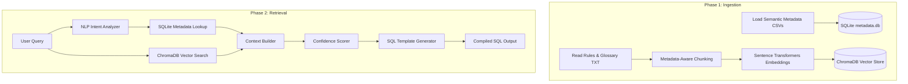

# NLP Semantic Data Pipeline Builder

An advanced, modular Natural Language Processing (NLP) Semantic Retrieval-Augmented Generation (RAG) and SQL compilation pipeline. This system converts natural language business queries into deterministic SQL queries by joining vector similarity search with structured databases.

---

## 👥 Author Information
- **Author**: Naresh Sanda
- **Role**: Technical Architect
- **Email**: [nareshkumar.sanda@gmail.com](mailto:nareshkumar.sanda@gmail.com)

---

## 🎯 Project Overview
This project serves as a proof of concept (POC) for building a semantic data warehouse retrieval pipeline. It implements:
1. **SQLite Database (`db/metadata.db`)** for structured and deterministic system metadata discovery.
2. **ChromaDB Vector Store (`vector_store/`)** for semantic retrieval of business rules, definitions, and governance glossaries.
3. **Sentence Transformers (`all-MiniLM-L6-v2`)** for translating text chunks into 384-dimensional dense vector embeddings.
4. **Clarification and Confidence Engine** to calculate query-context alignment score and decide if LLM query clarification is required.
5. **Deterministic Template SQL Generator** to map user intents and extracted dimensions to SQL statements.

---

## 🏗️ Architecture & Processing Phases

The pipeline runs in two sequential phases:



### Phase 1: Ingestion
- **Metadata Setup**: Resolves mappings for metrics, glossary terms, relationships, source mappings, and entities, saving them into SQLite database tables.
- **Semantic Chunking**: Splits textual documentation (`semantic_business_rules.txt` and `semantic_glossary.txt`) using a metadata-aware strategy.
- **Vector Indexing**: Generates dense embeddings for each text chunk using the `all-MiniLM-L6-v2` transformer and indexes them in a local ChromaDB collection.

### Phase 2: Retrieval
- **Intent Analysis**: Parses the incoming user query using a local rules-based `NLPAnalyzer` to extract metrics (e.g., *revenue*), dimensions (e.g., *customer*, *month*), and parameters (e.g., *top 10*).
- **SQLite Lookup**: Performs exact keyword and entity match queries against the structured metadata database.
- **RAG Retrieval**: Performs semantic vector searches in ChromaDB to retrieve relevant business rules.
- **Context Construction**: Merges database schema mappings and retrieved text chunks into structured context.
- **Confidence Gates & Clarification**: Scores context-query relevance. If the score falls below a threshold, the system flags the query for clarification.
- **SQL Generation**: Merges intent metadata and DB references into a structured template to compile executable SQL.

---

## 📐 Mathematical Vector Distance Metrics

When performing semantic searches in ChromaDB, the system relies on vector distance metrics to measure how close the query is to a document chunk. The three primary metrics are:

### 1. Squared L2 (Euclidean Distance)
* **Definition**: The straight-line distance between two points in multidimensional space.
* **Math**: $d(u,v) = \sum (u_i - v_i)^2$
* **Range**: $0$ (identical) to $+\infty$ (highly different).
* **Characteristics**: Cares about vector magnitude. If a document is long (large values/magnitude), L2 might penalize it even if it shares the same topic direction as a short query.
* **Best Use Case**: Uniformly sized text chunks, where raw hardware execution speed is the priority.

### 2. Cosine Similarity
* **Definition**: Measures the cosine of the angle between two vectors. It determines if they point in the same direction, ignoring their magnitude.
* **Math**: $d(u,v) = 1 - \frac{u \cdot v}{\|u\|_2 \|v\|_2}$
* **Range**: $0$ (identical direction) to $2$ (opposite directions).
* **Characteristics**: Completely size-invariant. Perfect for RAG pipelines where short queries are matched against long document chunks.
* **Best Use Case**: The industry standard for text retrieval and semantic search.

### 3. Inner Product (Dot Product)
* **Definition**: Combines direction and magnitude.
* **Math**: $d(u,v) = - (u \cdot v)$
* **Range**: $-\infty$ to $+\infty$ (more negative means more similar in distance-space).
* **Characteristics**: Rewards both alignment and magnitude (word frequency/importance).
* **Best Use Case**: Only used when the specific embedding model's documentation explicitly commands its use.

---

## 🔬 Advanced RAG Concepts & Evolution
As standard (Naive) RAG pipelines scale, they encounter context quality, reasoning, and logical linkage limitations. To address these issues, the pipeline can be upgraded with five advanced architectural patterns:

1. **Reranking**: Standard vector search uses fast bi-encoder cosine similarity. Reranking introduces a heavy cross-encoder model that scores query-document pairs directly, sorting retrieved chunks to ensure the most relevant rules are processed first.
2. **Query Expansion**: User queries are often short and keyword-poor. Query expansion leverages LLMs to rewrite and broaden queries with synonyms or sub-questions, widening the semantic retrieval net.
3. **Multi-Hop Retrieval**: Resolves queries requiring logical linkages (e.g. searching Entity A, resolving its name, and using that name to search metrics of Entity B) through sequential, dependent retrieval hops.
4. **Agentic RAG**: Replaces linear pipelines with an autonomous reasoning loop (LLM agent). The agent uses tools (vector search, SQLite checks, SQL validators) and self-reflects/corrects until it guarantees high-confidence output.
5. **RAG Evaluation Metrics**: Traditional unit tests cannot measure answer fidelity. The pipeline is measured using RAGAS metrics: Faithfulness (no hallucinations), Answer Relevance (query match), and Context Recall/Precision.

---

## 📁 Directory Structure
```
ai_dw_nlp_poc/
│
├── .vscode/                 # VSCode local settings
├── data/                    # Temporary data folder (initially empty)
├── db/                      # Target SQLite database (metadata.db)
├── metadata/                # Domain CSV and TXT rules configuration
├── src/                     # Source modules
│   ├── phase1_ingestion/    # loader, chunker, and embedder modules
│   └── phase2_retrieval/     # analyzer, lookup, retriever, scorer, sql_generator
├── vector_store/            # ChromaDB local storage directory
│
├── execution_flow.html      # Visual simulator for the pipeline
├── index.html               # Main interactive suite portal
├── rag_deep_dive.html       # Python vs Java architectural RAG deep dive
├── vector_distance_guide.html # Mathematical guide for vector metrics
├── advanced_rag_concepts.html # Interactive guide detailing advanced RAG upgrades
├── code_flow_guide.html     # Interactive reference manual mapping code flows to Java
│
├── requirements.txt         # Project package dependencies
├── run_demo.py              # End-to-end flow runner
├── run_phase1_ingestion.py  # Phase 1 executable
└── run_phase2_retrieval.py  # Phase 2 executable
```

---

## ⚙️ Setup & Installation

### Requirements
- **Python**: 3.11 or later
- **Pip**: Latest version

### Installation Steps
1. Navigate to the project root:
   ```bash
   cd ai_dw_nlp_poc
   ```
2. Create and activate a virtual environment:
   ```bash
   python -m venv .venv
   # Windows:
   .venv\Scripts\activate
   # macOS/Linux:
   source .venv/bin/activate
   ```
3. Install package dependencies:
   ```bash
   pip install -r requirements.txt
   ```

---

## 🚀 Running the Project

### 1. Unified Demo Runner
Run the combined end-to-end pipeline (Phase 1 Ingestion followed by Phase 2 Retrieval for test queries):
```bash
python run_demo.py
```

### 2. Manual Phase execution
If you prefer running components individually:

* **Step A: Run Ingestion (Phase 1)**
  Creates the SQLite schema, parses documentation, generates vector embeddings, and builds indexes.
  ```bash
  python run_phase1_ingestion.py
  ```

* **Step B: Run Retrieval (Phase 2)**
  Executes queries against the indexes created in Phase 1, evaluating intent and printing generated SQL.
  ```bash
  python run_phase2_retrieval.py
  ```

---

## 🖥️ Interactive HTML Portals
The project includes a suite of rich-designed, interactive local HTML dashboards for training and visualization. Open these directly in your browser:

* **🏠 [index.html](file:///d:/anvizent-datapipeline-nlp-poc/ai_dw_nlp_poc/index.html)**: The main educational portal hub.
* **📄 [execution_flow.html](file:///d:/anvizent-datapipeline-nlp-poc/ai_dw_nlp_poc/execution_flow.html)**: The step-by-step pipeline execution flow simulator.
* **🔬 [rag_deep_dive.html](file:///d:/anvizent-datapipeline-nlp-poc/ai_dw_nlp_poc/rag_deep_dive.html)**: Comprehensive transition analysis mapping Python structures directly to Java classes.
* **📐 [vector_distance_guide.html](file:///d:/anvizent-datapipeline-nlp-poc/ai_dw_nlp_poc/vector_distance_guide.html)**: Interactive guide detailing vector math, library analogies, and similarity scoring.
* **🔬 [advanced_rag_concepts.html](file:///d:/anvizent-datapipeline-nlp-poc/ai_dw_nlp_poc/advanced_rag_concepts.html)**: Interactive guide detailing advanced RAG upgrades (Reranking, Query Expansion, Multi-Hop, Agentic, and RAGAS metrics).
* **📖 [code_flow_guide.html](file:///d:/anvizent-datapipeline-nlp-poc/ai_dw_nlp_poc/code_flow_guide.html)**: Step-by-step logic tracing of Phase 1 Ingestion and Phase 2 Retrieval with side-by-side Java translations.
